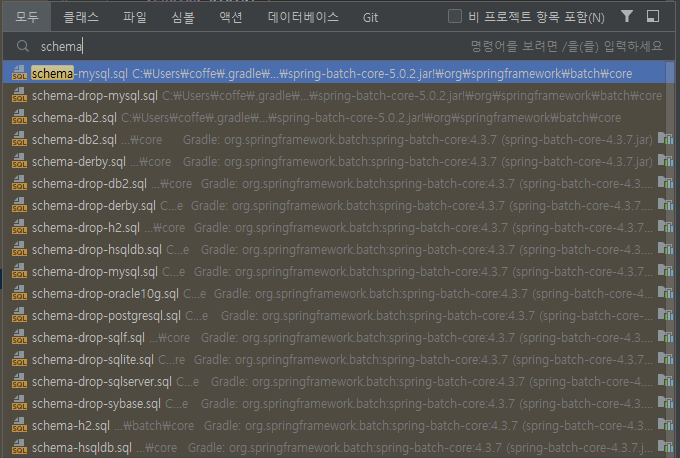
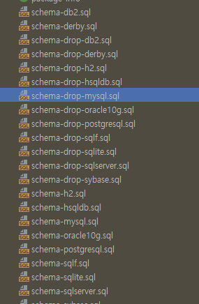

# 3. 스크립트 실행

## 1. 스크립트 찾기
> control + n 으로 파일을 찾을 수 있는 모두 탭에서 schema를 치면 아래와 같이 나온다. 아무 파일이 나 들어간다.


<br>
<br>  

---

## 2. 경로찾기
> 해당 파일에 들어가서 alt + F1 클릭하고 1를 누르면 해당파일의 경로까지 이동되는데
> 그 파일들 중에 자신의 DB와 맞는 스크립트 문을 실행하면된다. 실행 방법은 하나의 스크립트문에서 alt + enter를 하면된다.



## 3. 최신 스크립트
> 나는 위 경로에 있는 스크립트를 전부 실행했을 때 비어있는 필드들이 있어서 에러가 발생했다. 알아보니 
> 수정된 ddl문이 있는데 테이블을 전부 삭제하고 아래 ddl문으로 다시 실행했을 경우 정상 작동을 확인 할 수 있었다.
```sql
CREATE TABLE BATCH_JOB_INSTANCE  (
                                     JOB_INSTANCE_ID BIGINT  NOT NULL PRIMARY KEY ,
                                     VERSION BIGINT ,
                                     JOB_NAME VARCHAR(100) NOT NULL,
                                     JOB_KEY VARCHAR(32) NOT NULL,
                                     constraint JOB_INST_UN unique (JOB_NAME, JOB_KEY)
) ENGINE=InnoDB;

CREATE TABLE BATCH_JOB_EXECUTION  (
                                      JOB_EXECUTION_ID BIGINT  NOT NULL PRIMARY KEY ,
                                      VERSION BIGINT  ,
                                      JOB_INSTANCE_ID BIGINT NOT NULL,
                                      CREATE_TIME DATETIME(6) NOT NULL,
                                      START_TIME DATETIME(6) DEFAULT NULL ,
                                      END_TIME DATETIME(6) DEFAULT NULL ,
                                      STATUS VARCHAR(10) ,
                                      EXIT_CODE VARCHAR(2500) ,
                                      EXIT_MESSAGE VARCHAR(2500) ,
                                      LAST_UPDATED DATETIME(6),
                                      JOB_CONFIGURATION_LOCATION VARCHAR(2500) NULL,
                                      constraint JOB_INST_EXEC_FK foreign key (JOB_INSTANCE_ID)
                                          references BATCH_JOB_INSTANCE(JOB_INSTANCE_ID)
) ENGINE=InnoDB;

CREATE TABLE BATCH_JOB_EXECUTION_PARAMS  (
                                             JOB_EXECUTION_ID BIGINT NOT NULL ,
                                             TYPE_CD VARCHAR(6) NOT NULL ,
                                             KEY_NAME VARCHAR(100) NOT NULL ,
                                             STRING_VAL VARCHAR(250) ,
                                             DATE_VAL DATETIME(6) DEFAULT NULL ,
                                             LONG_VAL BIGINT ,
                                             DOUBLE_VAL DOUBLE PRECISION ,
                                             IDENTIFYING CHAR(1) NOT NULL ,
                                             constraint JOB_EXEC_PARAMS_FK foreign key (JOB_EXECUTION_ID)
                                                 references BATCH_JOB_EXECUTION(JOB_EXECUTION_ID)
) ENGINE=InnoDB;

CREATE TABLE BATCH_STEP_EXECUTION  (
                                       STEP_EXECUTION_ID BIGINT  NOT NULL PRIMARY KEY ,
                                       VERSION BIGINT NOT NULL,
                                       STEP_NAME VARCHAR(100) NOT NULL,
                                       JOB_EXECUTION_ID BIGINT NOT NULL,
                                       START_TIME DATETIME(6) NOT NULL ,
                                       END_TIME DATETIME(6) DEFAULT NULL ,
                                       STATUS VARCHAR(10) ,
                                       COMMIT_COUNT BIGINT ,
                                       READ_COUNT BIGINT ,
                                       FILTER_COUNT BIGINT ,
                                       WRITE_COUNT BIGINT ,
                                       READ_SKIP_COUNT BIGINT ,
                                       WRITE_SKIP_COUNT BIGINT ,
                                       PROCESS_SKIP_COUNT BIGINT ,
                                       ROLLBACK_COUNT BIGINT ,
                                       EXIT_CODE VARCHAR(2500) ,
                                       EXIT_MESSAGE VARCHAR(2500) ,
                                       LAST_UPDATED DATETIME(6),
                                       constraint JOB_EXEC_STEP_FK foreign key (JOB_EXECUTION_ID)
                                           references BATCH_JOB_EXECUTION(JOB_EXECUTION_ID)
) ENGINE=InnoDB;

CREATE TABLE BATCH_STEP_EXECUTION_CONTEXT  (
                                               STEP_EXECUTION_ID BIGINT NOT NULL PRIMARY KEY,
                                               SHORT_CONTEXT VARCHAR(2500) NOT NULL,
                                               SERIALIZED_CONTEXT TEXT ,
                                               constraint STEP_EXEC_CTX_FK foreign key (STEP_EXECUTION_ID)
                                                   references BATCH_STEP_EXECUTION(STEP_EXECUTION_ID)
) ENGINE=InnoDB;

CREATE TABLE BATCH_JOB_EXECUTION_CONTEXT  (
                                              JOB_EXECUTION_ID BIGINT NOT NULL PRIMARY KEY,
                                              SHORT_CONTEXT VARCHAR(2500) NOT NULL,
                                              SERIALIZED_CONTEXT TEXT ,
                                              constraint JOB_EXEC_CTX_FK foreign key (JOB_EXECUTION_ID)
                                                  references BATCH_JOB_EXECUTION(JOB_EXECUTION_ID)
) ENGINE=InnoDB;

CREATE TABLE BATCH_STEP_EXECUTION_SEQ (
                                          ID BIGINT NOT NULL,
                                          UNIQUE_KEY CHAR(1) NOT NULL,
                                          constraint UNIQUE_KEY_UN unique (UNIQUE_KEY)
) ENGINE=InnoDB;

INSERT INTO BATCH_STEP_EXECUTION_SEQ (ID, UNIQUE_KEY) select * from (select 0 as ID, '0' as UNIQUE_KEY) as tmp where not exists(select * from BATCH_STEP_EXECUTION_SEQ);

CREATE TABLE BATCH_JOB_EXECUTION_SEQ (
                                         ID BIGINT NOT NULL,
                                         UNIQUE_KEY CHAR(1) NOT NULL,
                                         constraint UNIQUE_KEY_UN unique (UNIQUE_KEY)
) ENGINE=InnoDB;

INSERT INTO BATCH_JOB_EXECUTION_SEQ (ID, UNIQUE_KEY) select * from (select 0 as ID, '0' as UNIQUE_KEY) as tmp where not exists(select * from BATCH_JOB_EXECUTION_SEQ);

CREATE TABLE BATCH_JOB_SEQ (
                               ID BIGINT NOT NULL,
                               UNIQUE_KEY CHAR(1) NOT NULL,
                               constraint UNIQUE_KEY_UN unique (UNIQUE_KEY)
) ENGINE=InnoDB;

INSERT INTO BATCH_JOB_SEQ (ID, UNIQUE_KEY) select * from (select 0 as ID, '0' as UNIQUE_KEY) as tmp where not exists(select * from BATCH_JOB_SEQ);


```

---

<br>
<br>


## yml mysql 연결
```yaml
spring:
  batch:
#    job:
#      names: ${job.name:NONE}
    jdbc:
      initialize-schema: never
  datasource:
    url: jdbc:mysql://localhost:3306/spring_batch?characterEncoding=UTF-8&serverTimezone=UTC
    driver-class-name: com.mysql.cj.jdbc.Driver
    username: root
    password: 1234
```

---

<br>
<br>

## 실행
> 스프링부트를 실행하고 아래 sql을 실행해보면 데이터가 저장된것을 확인할 수 있다. job이 실행될 때 마다 쌓이는 데이터이다.
```sql
select *
from BATCH_JOB_EXECUTION_PARAMS;
```

