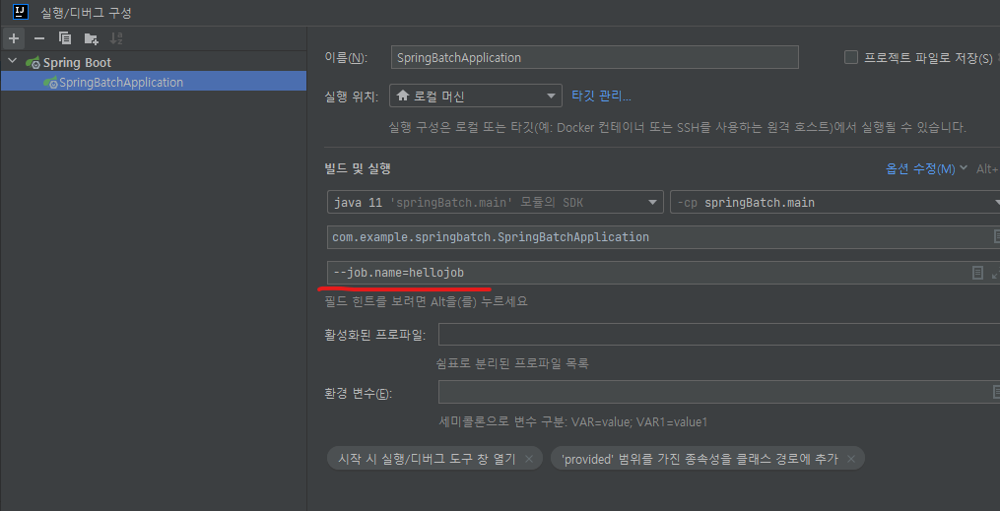

# 2.step-job-create

## 1. @EnableBatchProcessing 
> Application에 @EnableBatchProcessing를 추가해 배치를 사용할 수 있도록 한다.
```java
@SpringBootApplication
@EnableBatchProcessing
public class SpringBatchApplication {

	public static void main(String[] args) {
		SpringApplication.run(SpringBatchApplication.class, args);
	}

}
```
---

<br>
<br>  


##  2. job, step 생성

### 2-1. 클래스 생성
>  HelloConfiguration 클래스 생성
```java
@Configuration
@Slf4j
public class HelloConfiguration {
	
}
```

<br>
<br>  


### 2-2. step 생성
> 스텝을 생성한다. 
```java
@Configuration
@Slf4j
public class HelloConfiguration {

	private final StepBuilderFactory stepBuilderFactory;

	public HelloConfiguration( StepBuilderFactory stepBuilderFactory) {
		this.stepBuilderFactory = stepBuilderFactory;
	}

	@Bean
	public Step helloStep() {
		return stepBuilderFactory.get("helloStep")
								 .tasklet((contribution, chunkContext) -> {
									 log.info("hello spring batch");
									 return RepeatStatus.FINISHED;
								 }).build();
	}
}
```

<br>
<br>  


### 2-3. job 생성
```java
@Configuration
@Slf4j
public class HelloConfiguration {

	private final JobBuilderFactory jobBuilderFactory;
	private final StepBuilderFactory stepBuilderFactory;

	public HelloConfiguration(JobBuilderFactory jobBuilderFactory, StepBuilderFactory stepBuilderFactory) {
		this.jobBuilderFactory = jobBuilderFactory;
		this.stepBuilderFactory = stepBuilderFactory;
	}

	@Bean
	public Job helloJob() {
		return jobBuilderFactory.get("hellojob")
								.incrementer(new RunIdIncrementer())
								.start(helloStep())
								.build();
	}

	@Bean
	public Step helloStep() {
		return stepBuilderFactory.get("helloStep")
								 .tasklet((contribution, chunkContext) -> {
									 log.info("hello spring batch");
									 return RepeatStatus.FINISHED;
								 }).build();
	}
}
```
---

<br>
<br>  

## yml 설정
> job이 많아서 한번 실행되는 것을 막기 위해서는 아래와 같이 설정할 수 있다. --job.name={jobName}
```java
@Bean
public Job helloJob() {
    return jobBuilderFactory.get("hellojob")  // hellojob이게 jobName 이다.
                            .incrementer(new RunIdIncrementer())
                            .start(helloStep())
                            .build();
}
```  

```yaml
spring:
  batch:
    job:
      names: ${job.name:NONE}
```



